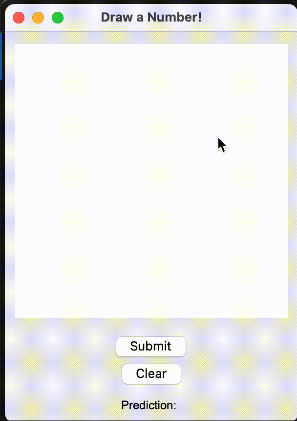

# Digit and Face Recognition

This project uses the MNIST handwritten digit dataset and a face dataset to train a two-layer neural network. Here are some of the key files:

### 1. **Predict Digit**:
   Use the `PredictDigit.py` script to predict a digit from the MNIST dataset. To select a different tester image, change the corresponding index.

### 2. **Predict Face**:
   Run the `PredictFace.py` script to predict a face from the face dataset. Like the digit prediction, change the corresponding index in the code to select a tester image.

### 3. **Draw Your Own Digit**:
   Run `PredictDrawing.py` to draw your own digit for the trained model to predict.

Spring 2024
